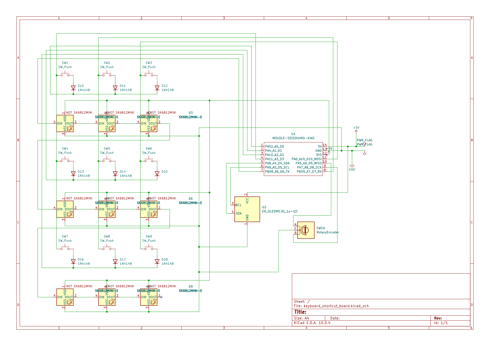
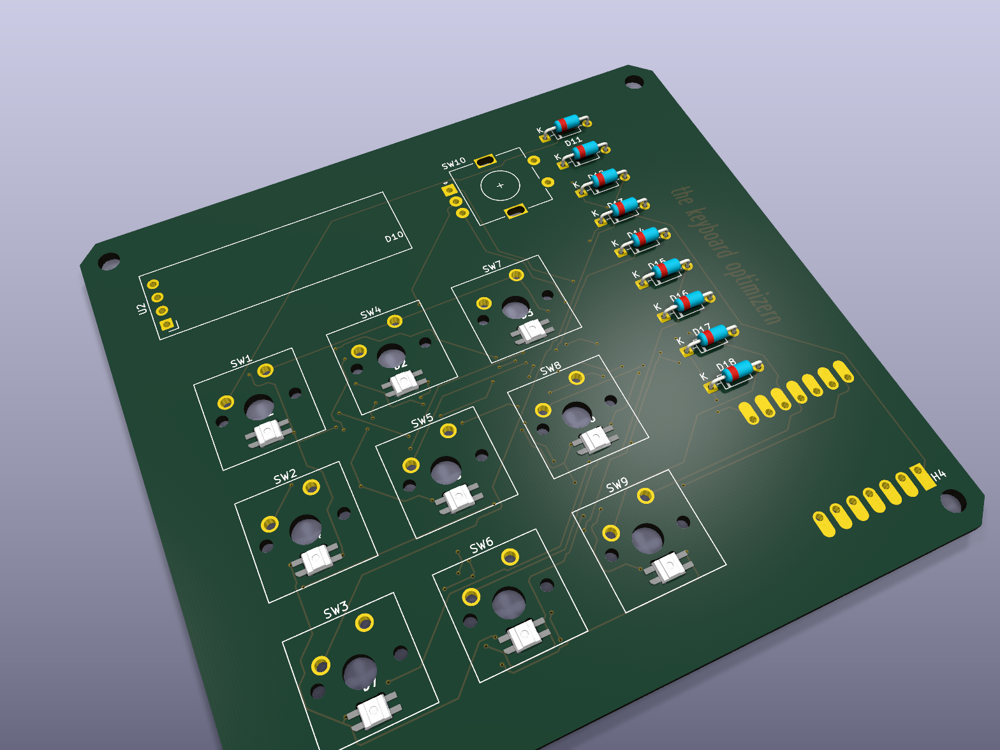
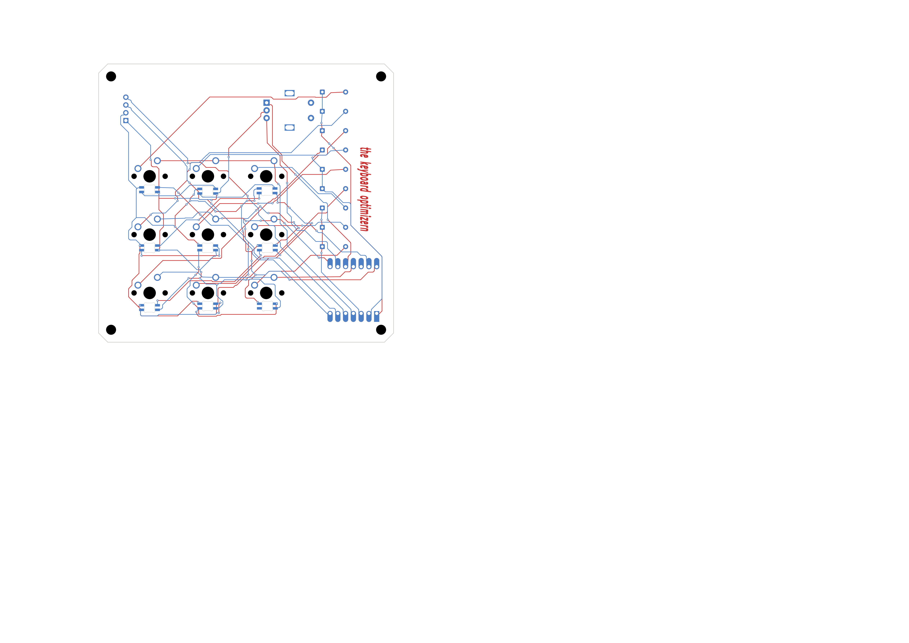
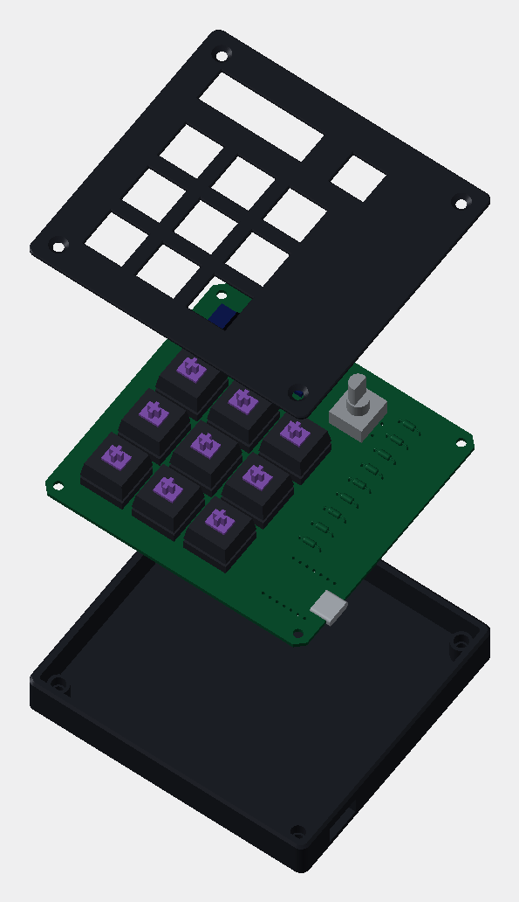

# keyboard shortcut board

a 3x3 macropad for shortcuts, built for [hackpad](https://hackpad.hackclub.com).
9 keys, a rotary encoder, per key rgb, and a 0.91" oled that shows a clock and a
spinning globe.

## schematic



## pcb



96.38 x 90.90mm, 2 layers. chamfered corners, and 4x m3 mounting holes on an
88.226 x 82.748mm rectangle for a sandwich case.

the 9 sk6812mini-e leds are reverse mounted. they sit in milled slots in the
board and shine up through the switches, so the lighting is per key rather than
underglow.



red is front copper, blue is back. the xiao sits on the underside so the usb-c
port clears the case wall.

## case



a sandwich: 1.5mm switch plate on top, the pcb in the middle, tray bottom
underneath. 102.38 x 96.90mm overall, 16.6mm tall closed.

the pcb rests on four bosses at 10mm, which leaves a 7.5mm cavity under the
board for the reverse mounted leds and the xiao. m3 heatset inserts drop into
the bosses from above. the only overhang is the usb-c slot in the side wall,
which is a 7mm bridge.

`cad/Hackpad Top v2.step` and `cad/Hackpad Bottom v2.step`.

## oled


the globe is generated from real natural earth coastline data. 24 frames, made
by projecting the land polygons onto a tilted sphere, so those are actual
continents at 32x32 pixels.

## bom

| qty | part | refs | in the hackpad kit? |
|---|---|---|---|
| 1 | seeed xiao rp2040 | U1 | yes (1 supplied) |
| 9 | mx style switch | SW1-SW9 | yes (16 supplied) |
| 9 | 1n4148 diode, do-35 | D10-D18 | yes (20 supplied) |
| 9 | sk6812mini-e rgb led | D1-D9 | yes (20 supplied) |
| 1 | ec11 rotary encoder, 20mm d-shaft | SW10 | yes (2 supplied) |
| 1 | 0.91" 128x32 i2c oled | U2 | yes (1 supplied) |
| 9 | dsa blank keycap | - | yes (16 supplied) |
| 4 | m3x16 screw | H1-H4 | yes (6 supplied) |
| 4 | m3x5x4 heatset insert | H1-H4 | yes (6 supplied) |
| 1 | knob for the encoder | - | **no, print it or source it yourself** |

everything except the encoder knob comes from the standard kit.

## keymap

| | | |
|---|---|---|
| open spotify | open chrome | open vs code |
| f11 | screenshot | calculator |
| copy | paste | undo |

the encoder does volume.

the three app launchers use windows taskbar shortcuts (`win`+`1`/`2`/`3`), so
**pin spotify, chrome and vs code to the first three taskbar slots** and the top
row works with no extra software.

## clock

there's no rtc on the board and usb hid can't send the time, so the clock
free runs from a timer and you set it by hand:

- hold the two **top corner keys** together to toggle set mode
- **encoder** adjusts minutes
- **top left / top right** keys adjust hours
- **top middle** exits

it resets to 00:00:00 whenever you unplug it, and drifts a few seconds a day.

## pins

| xiao pin | rp2040 | function |
|---|---|---|
| d0, d1, d2 | gp26, gp27, gp28 | matrix columns |
| d3, d7, d10 | gp29, gp1, gp3 | matrix rows |
| d4, d5 | gp6, gp7 | oled i2c (sda, scl) |
| d6 | gp0 | sk6812 data |
| d8, d9 | gp2, gp4 | encoder b, a |

3x3 matrix, `row2col`. all 11 gpio are used, which is why the encoder's push
switch isn't wired.

## firmware

qmk. `firmware/firmware.uf2` is prebuilt, so to flash it just double tap reset
on the xiao and drag the file onto the drive that appears.

to build it yourself, drop `firmware/` into
`qmk_firmware/keyboards/keyboard_shortcut_board/` and run:

```
qmk compile -kb keyboard_shortcut_board -km default
```

## layout

```
pcb/        kicad source, gerbers and the board step
firmware/   qmk source and the compiled uf2
cad/        case model
assets/     images for this readme
```

## license

> **TODO:** pick one, mit is a fine default
